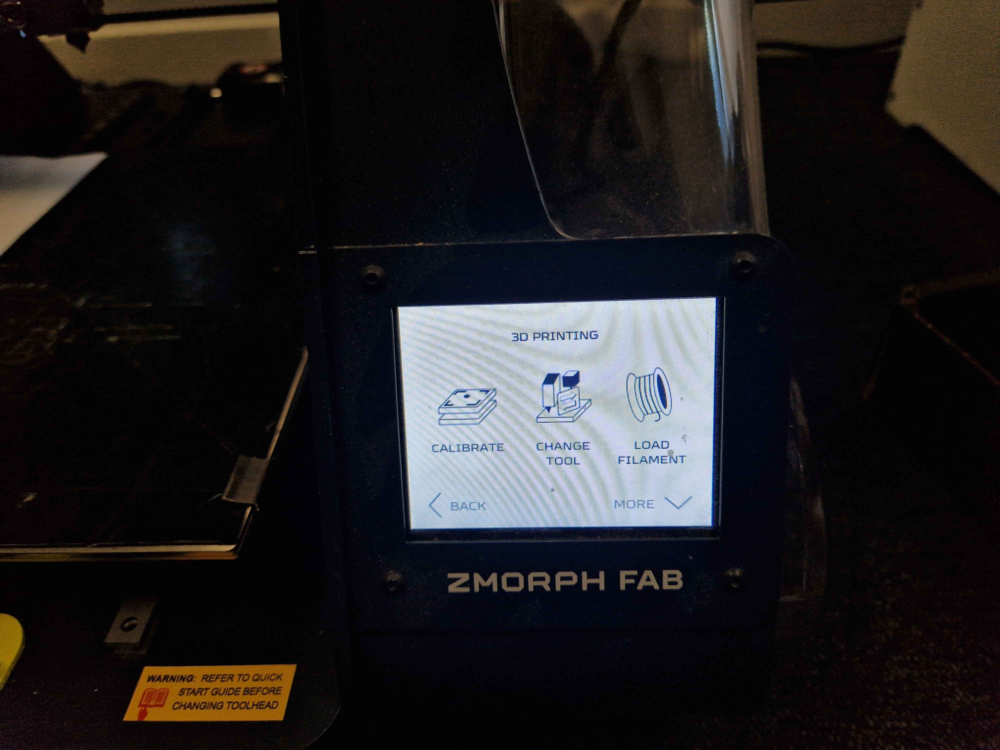

# Zmorph-3D-Printer-instruks

## Startup
Start med at sikre dig at printerern er sat til strøm og er tændt. Du kan finde tænd knappen på fronten til højre.

### Kalibrering
Hvis det er første gang du bruger printeren eller du oplever problemer med upræcise print, så følg disse trin. _Denne del er vigtig, fejl kan i tilfælde ødelægge printeren_.  
For at starte **skal** du bruge et stykke papir. **Automatisk kalibrering virker ikke ordenligt**

På hovedskærmen, naviger til "Maintenance" 

Derefter naviger til "Calibrate" 

Bemærk, automatisk kalibrering virker ikke nuværende, så vi skal vælge "Manual Calibration"  

## Slicer
For at kunne bruge Zmorph 3D printeren, skal du downloade noget der hedder [Voxelizer](https://zmorph3d.com/software/).
Download Voxelizer til ZMorph Fab.  Vær opmærksom på at siden er lidt langsom, så vær tålmodig.
